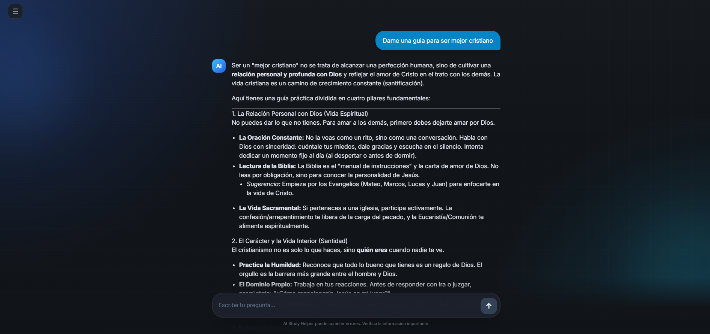

# AI_Study_Helper
A SaaS software with which you can use AI for summarizing PDF, create study flashcards and more!


## Overview

AI Study Helper allows students to upload study materials (like PDFs or text), and it uses AI to generate summaries, quizzes, and flashcards.  
It’s designed to make studying faster and smarter for high school and university students.

## Current Features

- AI chat interface
- Send messages and receive AI responses
- React frontend with a clean UI
- Express backend API
- AI service integration
- Full communication between frontend and backend

More features such as PDF analysis, flashcards, and quizzes are planned.
## Screenshots
Example of the AI response inside the chat interface.



## Project Structure

project-root/
│
├── frontend/   → React application (user interface)
├── backend/    → Express + MongoDB API (server logic)
├── docs/       → Notes, architecture and development documentation
└── README.md

## Technologies

- **Frontend:** React, TailwindCSS, Vite  
- **Backend:** Node.js, Express
- **Database** MongoDB Atlas (upcoming)    
- **Version Control:** Git + GitHub (SSH setup) 

## How to run the project

Setup and Installation

1. Clone the repository  
   ```bash
   git clone git@github.com:Yedal2607/ai-study-helper.git

2. Navigate into the project folder
   ```bash
   cd ai-study-helper

3. Install dependencies 
    ```bash
    cd frontend
    npm install
    cd ../backend
    npm install

4. Run the development servers (once setup is complete)
    ```bash
    npm run dev

## Project Status
Current stage: **MVP**
Completed

- Backend API
- Frontend interface
- AI chat working


In progress
- Study features
- Flashcards generation
- PDF analysis
- Authentication
  
Planned
- File uploads
- Study dashboards

## Author
Developed by [Yedal Abreu](https://github.com/Yedal2607)  

An aspiring fullstack developer passionate about building practical AI-powered tools😁.

## 📄 License
This project is open-source and available under the MIT License.
