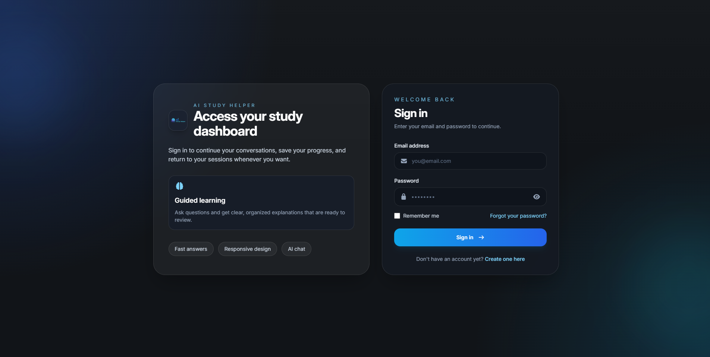
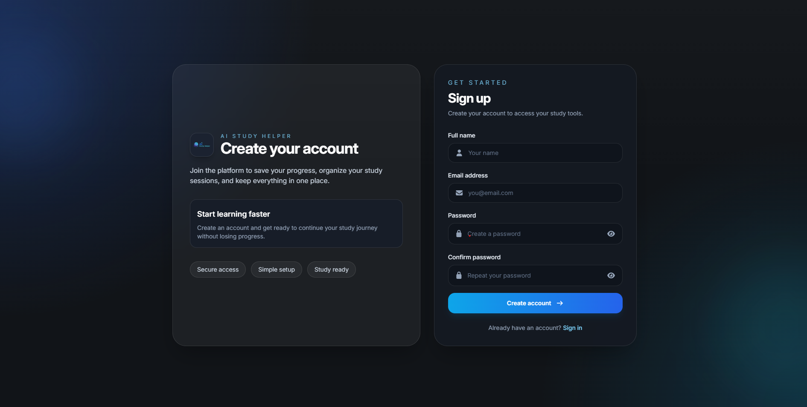
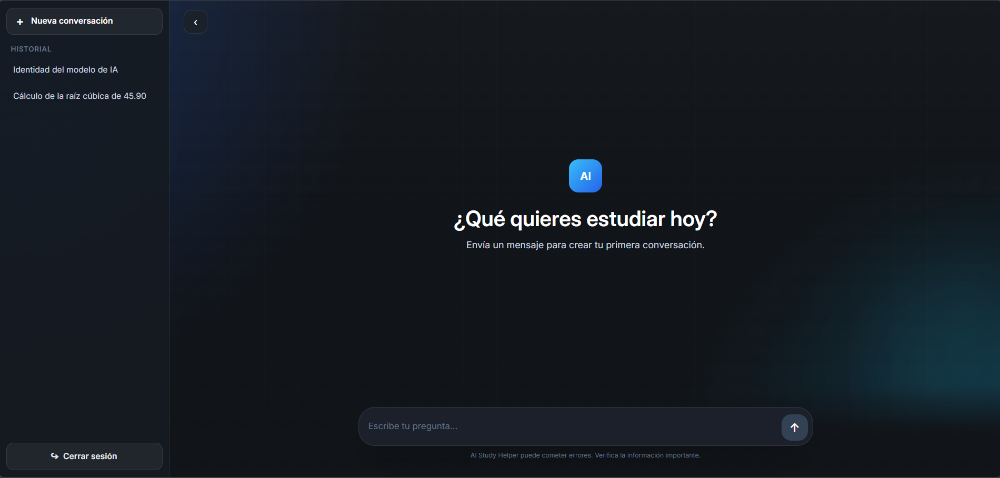

# AI Study Helper
AI Study Helper is an adaptive learning platform that uses AI to help students learn more
effectively.
Instead of functioning as a traditional AI chatbot, the platform is designed to continuously
understand how each student learns and use that understanding to personalize future learning
experiences.
The long-term goal is to create a learning system where every interaction contributes to a
progressively more personalized learning experience.

## Vision
AI Study Helper aims to maximize learning efficiency by continuously adapting to each student's
learning needs.
The system is designed around a continuous learning cycle:
```text
Learning Input
↓
Study Session
↓
Learning Observations
↓
Learning Analysis
↓
Learning Evidence
↓
Learning Profile
↓
Adaptive Learning
↓
More Personalized Study Sessions
```
Rather than treating every interaction as an isolated conversation, AI Study Helper aims to use
accumulated learning evidence to improve future study sessions.

## Current State
AI Study Helper is currently in the early MVP stage.
The current implementation provides the foundation for the platform, including user authentication
and AI-powered conversation.

### Currently Implemented
- User registration
- User login
- JWT-based authentication
- Protected routes
- AI chat
- Responsive user interface
- React Router
- Express REST API
- MongoDB integration
  
The current AI chat is an initial implementation and is not yet the complete Study Session
experience defined by the domain model.
Future development will expand this foundation into the adaptive learning system described in the
project's vision.

## Planned Capabilities
The platform is intended to evolve toward capabilities such as:

### Learning Input
- Documents
- Text
- Images
- Audio
- URLs
### Study Sessions
- AI explanations
- Quizzes
- Flashcards
- Analogies
- Interactive questions
- Practical exercises
- Other adaptive learning activities
### Learning Profile
- Learning strengths
- Learning weaknesses
- Learning methods
- Knowledge trends
- Engagement patterns
- Adaptation history
### Adaptive Learning
- Learning analysis
- Learning evidence
- Learning strategy selection
- Personalized future study sessions
These capabilities will be implemented progressively as the system evolves.

## Architecture
AI Study Helper is being developed using an architecture-first approach.
The project separates the understanding of the product from its implementation.
```text
Vision
↓
Domain Model
↓
System Architecture
↓
Implementation
```
The domain defines the core concepts and business rules of the adaptive learning system
independently of specific technologies.
The frontend and backend are then structured around these concepts and responsibilities.

## Project Structure
```text
project-root/
nnn frontend/ React application (user interface)
nnn backend/ Express + MongoDB API (server logic)
nnn docs/ System and domain documentation
nnn README.md
```

### Frontend
The frontend is organized around product capabilities using a feature-based structure.
```text
frontend/
nnn src/
nnn features/
nnn components/
nnn assets/
nnn ...
```
Feature-specific code is kept within its corresponding feature, while reusable application-wide
components are kept separately.

## Domain
The core domain currently includes:
- Student
- Learning Input
- Study Session
- Learning Observation
- Learning Analysis
- Learning Evidence
- Learning Profile
- Adaptive Learning Engine
- Learning Strategy
These concepts form the foundation of the adaptive learning system.
For more details about the domain and its relationships, see `docs/domain.md`.
## Documentation
The project documentation is maintained separately from the implementation.

### Vision
Defines the purpose, direction, and long-term goals of AI Study Helper.
`docs/vision.md`

### Domain Model
Defines the business concepts, relationships, workflow, and rules that make up the adaptive
learning system.
`docs/domain.md`
More documentation will be added as the architecture and implementation evolve.

## Screenshots

### Login Page

The login page allows returning students to authenticate and access the platform.
### Register Page

The registration page allows new students to create an account.
### AI Chat

The current AI chat provides the initial conversational learning experience and serves as a
foundation for the future Study Session capability.
## Technologies
- **Frontend:** React, Tailwind CSS, Vite, React Router
- **Backend:** Node.js, Express, REST API
- **Database:** MongoDB, MongoDB Atlas
- **Version Control:** Git + GitHub
## How to Run the Project

### Setup and Installation
1. Clone the repository
```bash
git clone git@github.com:Yedal2607/ai-study-helper.git
```
2. Navigate into the project folder
```bash
cd ai-study-helper
```
3. Install dependencies
```bash
cd frontend
npm install
cd ../backend
npm install
```
4. Run the development servers
```bash
npm run dev
```

## Project Status
Current stage: **Early MVP**

### Completed
- Project foundation
- Backend API
- Frontend interface
- User registration and login
- JWT authentication
- Protected routes
- AI chat
- Responsive interface
- Initial system documentation
- Domain model

### In Progress
- Frontend architectural refactoring
- Feature-based project structure
- Study Session design
- Learning Input design
- Adaptive learning architecture

### Planned
- File uploads
- PDF analysis
- Flashcard generation
- Quiz generation
- Learning Observations
- Learning Analysis
- Learning Evidence
- Learning Profile
- Adaptive Learning Engine
- Personalized Study Sessions
- Learning progress and analytics

## Development Philosophy
AI Study Helper is being developed with the following principles:
- **Efficiency over unnecessary complexity**
- **Simplicity of interaction**
- **Adaptive learning**
- **Evidence-based personalization**
- **Architecture before implementation**
- **Continuous improvement**
The goal is not simply to add more AI features, but to build a coherent learning system where each
capability contributes to the student's long-term learning experience.

## Author
Developed by [Yedal Abreu](https://github.com/Yedal2607)
An aspiring full-stack developer passionate about building practical software products and AI-
powered systems.

## License
This project is open-source and available under MIT license
